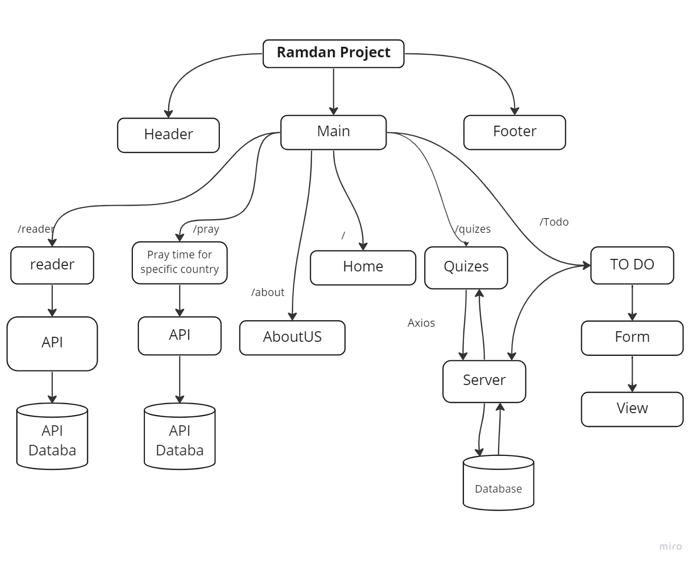

# Dhikraa_Froutend Project

## Team member:
* **Walaa' Atiyh**
* **Amani M Al-Zoubi**
* **Ihab Abbas**
* **mohammad alghzawi**
* **Bashar Telfah**

## heroku link :<https://dhiker-api-v1.herokuapp.com/>

## wireframe 



## Description

**The Ramdan is coming so for that we decided to make a web site that will contain many kinds of pages that will engourge to do worshib in a good way and every user can make his plan on it to organize his time for that.**

**The website can be help people to make his lifestyle organize with many useful activity that will improve his inner self and the out one.**


## Useful Notes
The backend functionalities can be divided into 2 categories, those that serve the frontend app (NEXT js), and those used for the administration of the store (which is different from the Django Admin).
<br>


<br>


This is a [Next.js](https://nextjs.org/) project bootstrapped with [`create-next-app`](https://github.com/vercel/next.js/tree/canary/packages/create-next-app).

## Getting Started

First, run the development server:

```bash
npm run dev
# or
yarn dev
# or
pnpm dev
```

Open [http://localhost:3000](http://localhost:3000) with your browser to see the result.

You can start editing the page by modifying `app/page.tsx`. The page auto-updates as you edit the file.

[API routes](https://nextjs.org/docs/api-routes/introduction) can be accessed on [http://localhost:3000/api/hello](http://localhost:3000/api/hello). This endpoint can be edited in `pages/api/hello.ts`.

The `pages/api` directory is mapped to `/api/*`. Files in this directory are treated as [API routes](https://nextjs.org/docs/api-routes/introduction) instead of React pages.

This project uses [`next/font`](https://nextjs.org/docs/basic-features/font-optimization) to automatically optimize and load Inter, a custom Google Font.

## Learn More

To learn more about Next.js, take a look at the following resources:

- [Next.js Documentation](https://nextjs.org/docs) - learn about Next.js features and API.
- [Learn Next.js](https://nextjs.org/learn) - an interactive Next.js tutorial.

You can check out [the Next.js GitHub repository](https://github.com/vercel/next.js/) - your feedback and contributions are welcome!

## Deploy on Vercel

The easiest way to deploy your Next.js app is to use the [Vercel Platform](https://vercel.com/new?utm_medium=default-template&filter=next.js&utm_source=create-next-app&utm_campaign=create-next-app-readme) from the creators of Next.js.

Check out our [Next.js deployment documentation](https://nextjs.org/docs/deployment) for more details.


### To Start the frontend in your local host

1. npm install react next react-router
2. npm install axios
3. npm install moment 
4. npm install sweetalert2
5. npm install swr
6. npm i react-youtube
7. npm install --save-dev @iconify/react